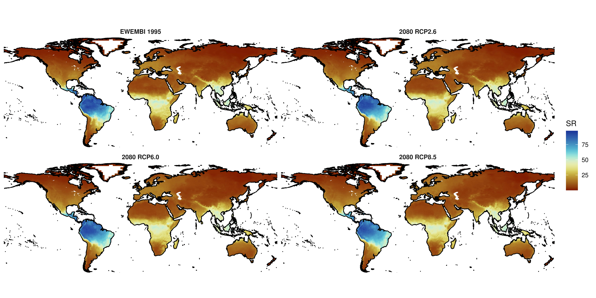
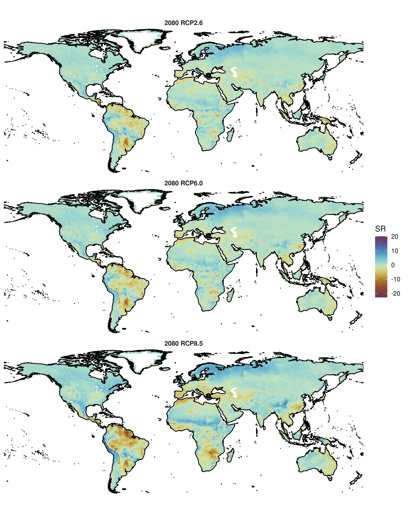
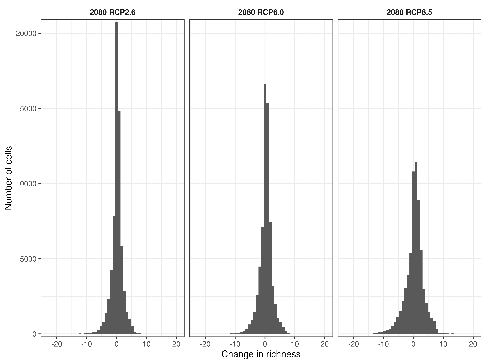
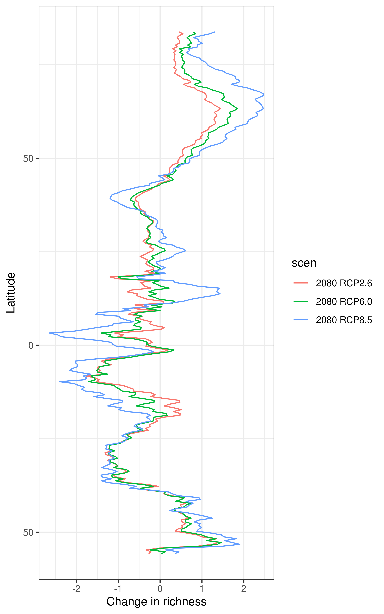
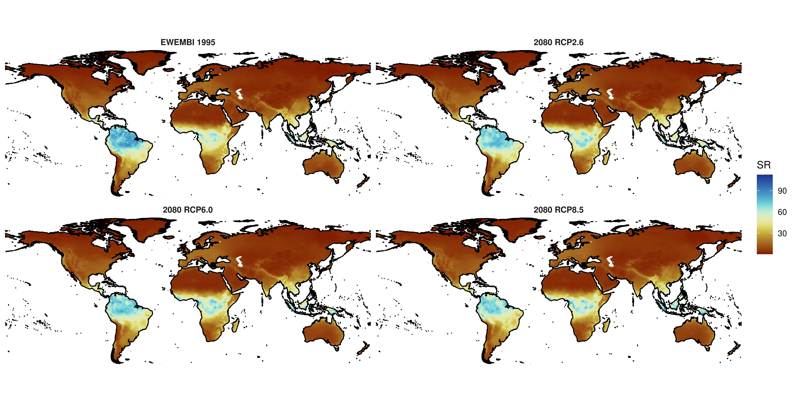
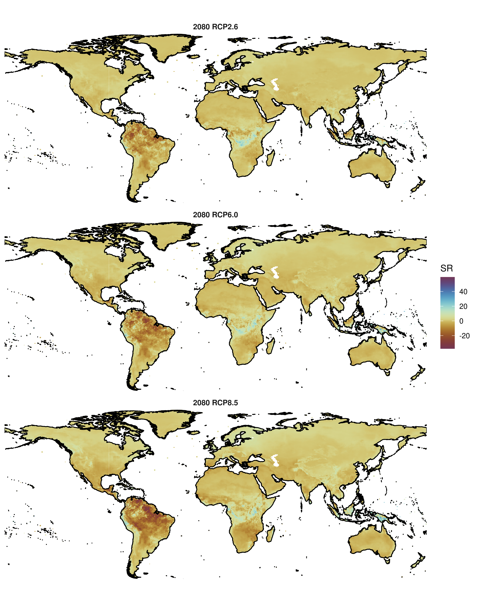
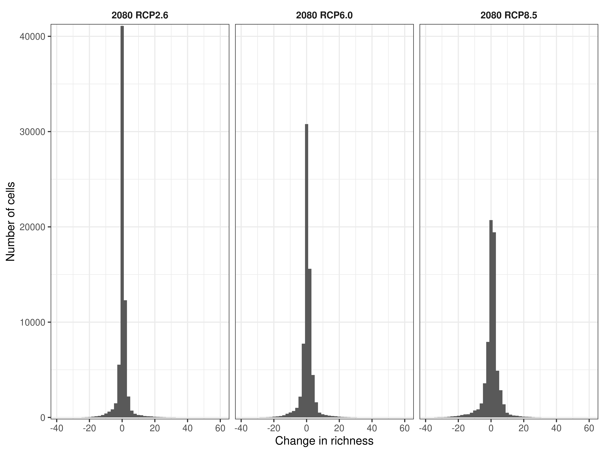
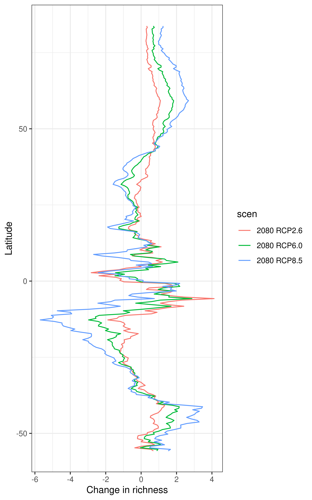

## Species Distribution Models (SDMs)

This is a first analysis based on our global SDM models, which are readily available to work with. We have SDMs for 869 of the 1265 bat species.
The SDMs were run with 4 bioclimatic variables: bio4, bio5, bio12 and bio15

```{r setup, include=F}
knitr::opts_chunk$set(collapse = TRUE, warning=FALSE, echo=FALSE, message=FALSE, fig.width=8, fig.height=6)
```



**Fig. 1.** Richness maps for 1995 and 2080 under three RCPs (RCP2.6, RCP6.0 and RCP8.5) using SDMs.



**Fig. 2.** Maps of the change in species richness for 2080 compared to 1995 under three RCPs (RCP2.6, RCP6.0 and RCP8.5) using SDMs.



**Fig. 3.** Histograms of the change in species richness for 2080 compared to 1995 under three RCPs (RCP2.6, RCP6.0 and RCP8.5) using SDMs.



**Fig. 4.** Latitudinal changes in species richness for 2080 compared to 1995 under three RCPs (RCP2.6, RCP6.0 and RCP8.5) using SDMs.

## Macroecological richness models (MEMs)



**Fig. 5.** Richness maps for 1995 and 2080 under three RCPs (RCP2.6, RCP6.0 and RCP8.5) using MEMs.



**Fig. 6.** Maps of the change in species richness for 2080 compared to 1995 under three RCPs (RCP2.6, RCP6.0 and RCP8.5) using MEMs.



**Fig. 7.** Histograms of the change in species richness for 2080 compared to 1995 under three RCPs (RCP2.6, RCP6.0 and RCP8.5) using MEMs.



**Fig. 8.** Latitudinal changes in species richness for 2080 compared to 1995 under three RCPs (RCP2.6, RCP6.0 and RCP8.5) using MEMs.
