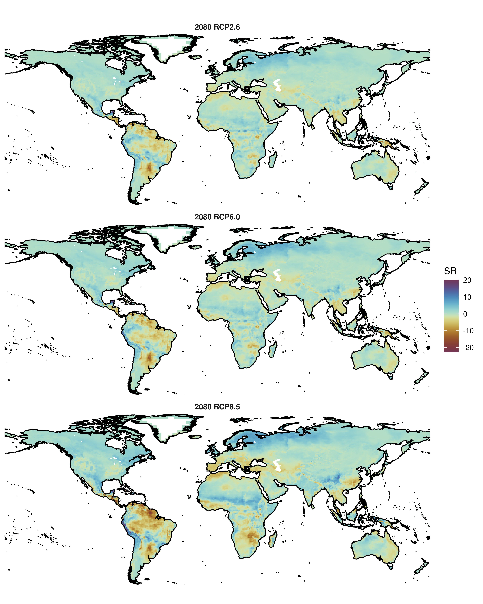
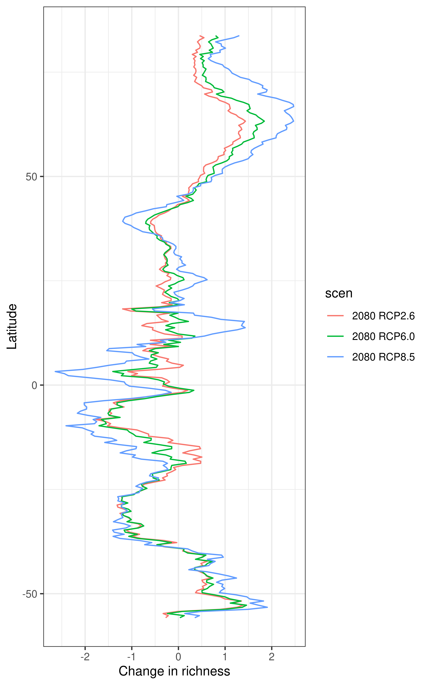
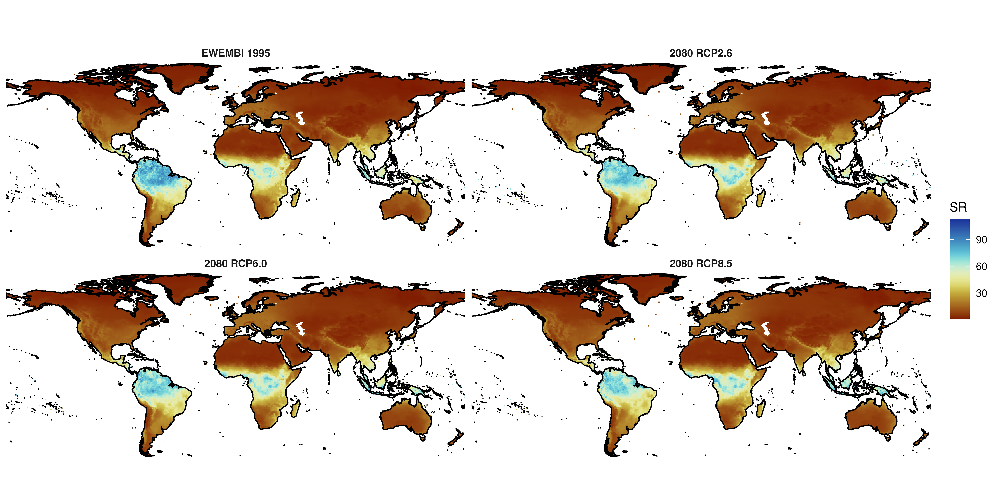
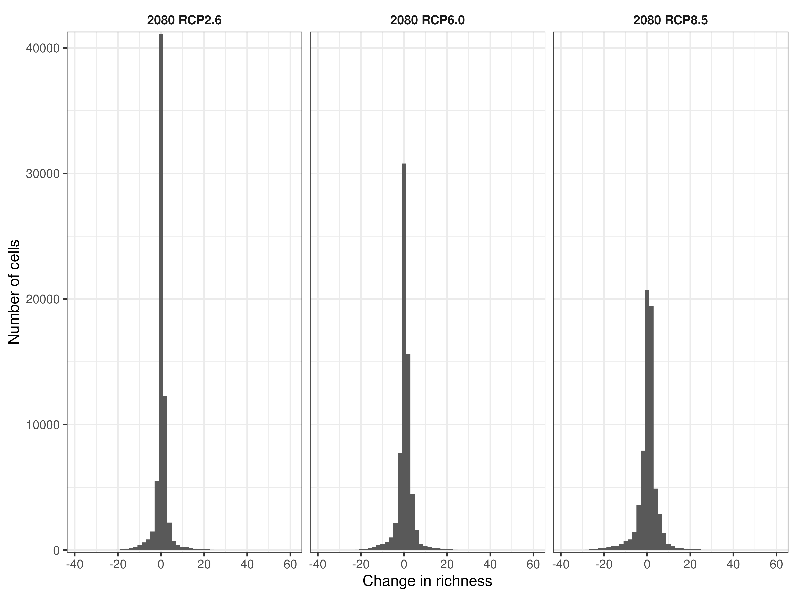
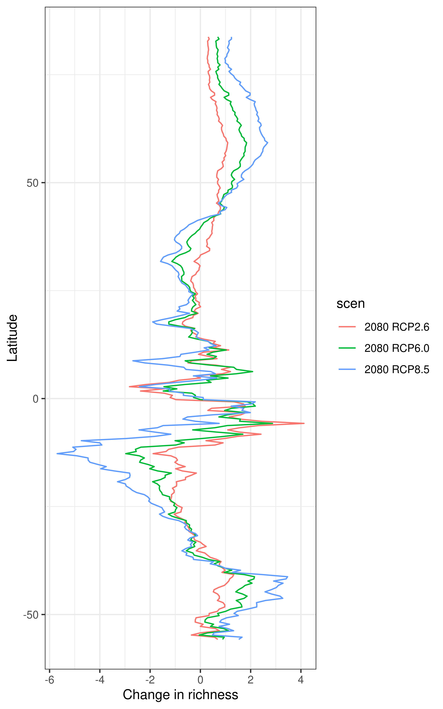

futBats: Predicting future global bat richness using SDMs/MEMs
================

## Species Distribution Models (SDMs)

This is a first analysis based on our global SDM models, which are
readily available to work with. We have SDMs for 869 of the 1265 bat
species. The SDMs were run with 4 bioclimatic variables: bio4, bio5,
bio12 and bio15

**Fig. 1.** Richness maps for 1995 and 2080 under three RCPs (RCP2.6,
RCP6.0 and RCP8.5) using SDMs.

**Fig. 2.** Maps of the change in species richness for 2080 compared to
1995 under three RCPs (RCP2.6, RCP6.0 and RCP8.5) using SDMs.

**Fig. 3.** Histograms of the change in species richness for 2080
compared to 1995 under three RCPs (RCP2.6, RCP6.0 and RCP8.5) using
SDMs.

**Fig. 4.** Latitudinal changes in species richness for 2080 compared to
1995 under three RCPs (RCP2.6, RCP6.0 and RCP8.5) using SDMs.

## Macroecological richness models (MEMs)

**Fig. 5.** Richness maps for 1995 and 2080 under three RCPs (RCP2.6,
RCP6.0 and RCP8.5) using MEMs.

**Fig. 6.** Maps of the change in species richness for 2080 compared to
1995 under three RCPs (RCP2.6, RCP6.0 and RCP8.5) using MEMs.

**Fig. 7.** Histograms of the change in species richness for 2080
compared to 1995 under three RCPs (RCP2.6, RCP6.0 and RCP8.5) using
MEMs.

**Fig. 8.** Latitudinal changes in species richness for 2080 compared to
1995 under three RCPs (RCP2.6, RCP6.0 and RCP8.5) using MEMs.
